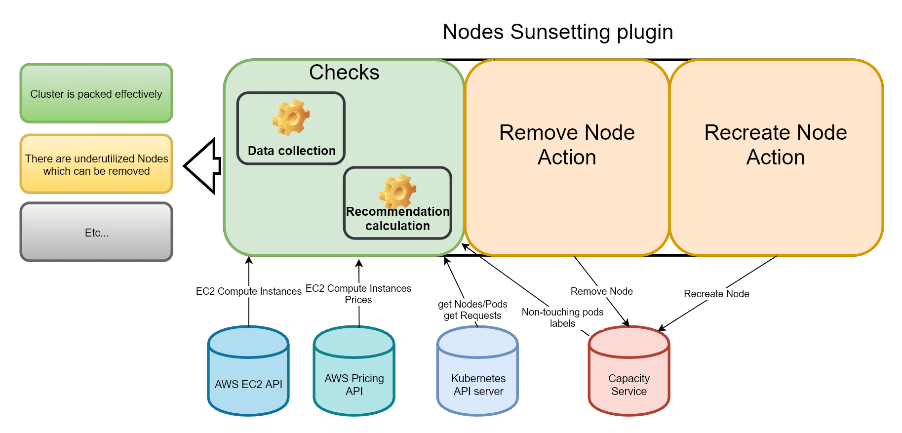

#Nodes Sunsetting plugin

#Design 

##Open questions:
1. * **Weakness** Current implementation do not assume that cluster shall survive single node failure.  
	* **Solution** Make configuration checkbox ``preserve_resources_for_single_node_failure`` to calculate possible candidates for sunsetting preserving needed spare resources.
2. * **Weakness** Current implementation do not counts that some pods can't be rescheduled based on:  
		* Taints and Tolerations  
		* Node affinity  
		* Inter-pod affinity/anti-affinity  
		* PV Claims  
		* etc...  
   * **Possible solution** Make all listed checks.   

##Note
Works only when ProviderID is set. (currently only AWS is supported)   
it matches EC2 instances with k8s cluster minions based on next equality:
k8s node -> ProviderID === ec2 instance -> Instance ID